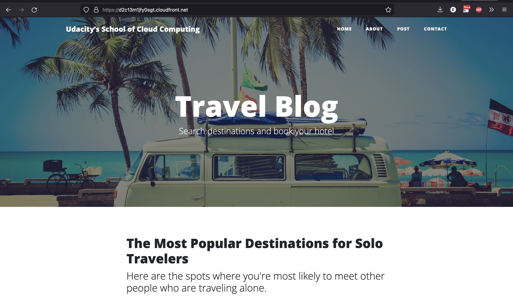

# aws-s3-deploy-static

This project explains how to deploy a static website on AWS

### Our Deployed static website can be accessed via the following links

[Link 1: Cloud Front](https://d2c13m1jfy0sgt.cloudfront.net) 
[Link 2: Default](http://udacity-edwards.s3-website-us-east-1.amazonaws.com)

# Website example

